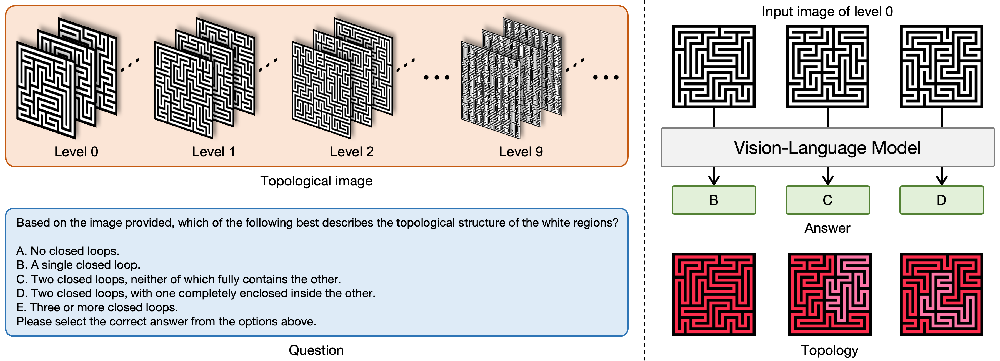

# TopoPerception

[](https://arxiv.org/abs/2511.11831)
[](https://huggingface.co/datasets/Wenhao-Zhou/TopoPerception)
[](https://github.com/Wenhao-Zhou/TopoPerception)

This repository contains the data and code for the paper "[TopoPerception: A Shortcut-Free Evaluation of Global Visual Perception in Large Vision-Language Models](https://arxiv.org/abs/2511.11831)".



It provides both:

- **TopoPerception dataset**: A set of images for evaluating the global visual perception abilities of Large Vision-Language Models (LVLMs) without local shortcuts.

- **Evaluation scripts**: Python scripts providing the prompt for evaluating various LVLMs (OpenAI, Anthropic, Google) on the TopoPerception dataset.

## Usage

### Install dependencies

Install the required Python dependencies:

```bash
pip install -r requirements.txt
```

### Set up API keys

Add your **API keys** and **base URLs** for each model family you plan to use (OpenAI, Anthropic, Google) in the `.env` file.

### Run the evaluation script

Execute the corresponding Python file for the model family you want to evaluate.

#### OpenAI:

```bash
python eval_openai.py --model o3  # Replace 'o3' with the model of your choice (e.g., 'o3', 'o4-mini', 'gpt-4o', etc)
```

#### Anthropic:

```bash
python eval_anthropic.py --model claude-opus-4-0  # Replace 'claude-opus-4-0' with the model of your choice (e.g., 'claude-opus-4-0', 'claude-sonnet-4-0', etc)
```

#### Google:

```bash
python eval_google.py --model gemini-2.5-pro  # Replace 'gemini-2.5-pro' with the model of your choice (e.g., 'gemini-2.5-pro', 'gemini-2.5-flash', etc)
```
